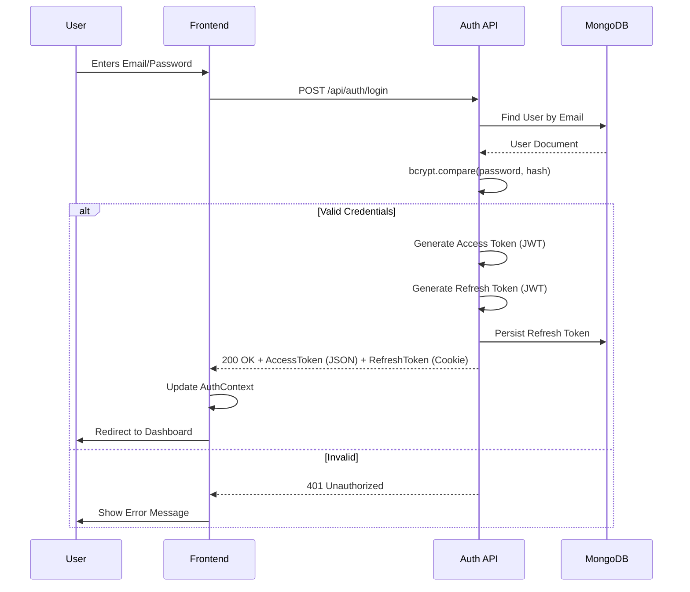
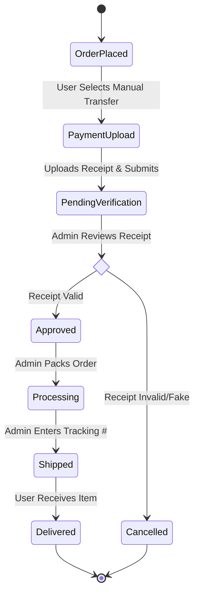
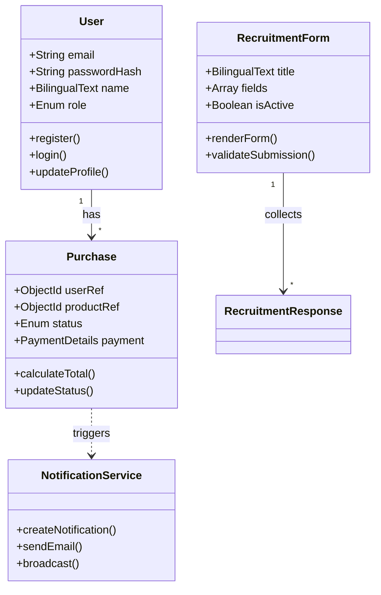
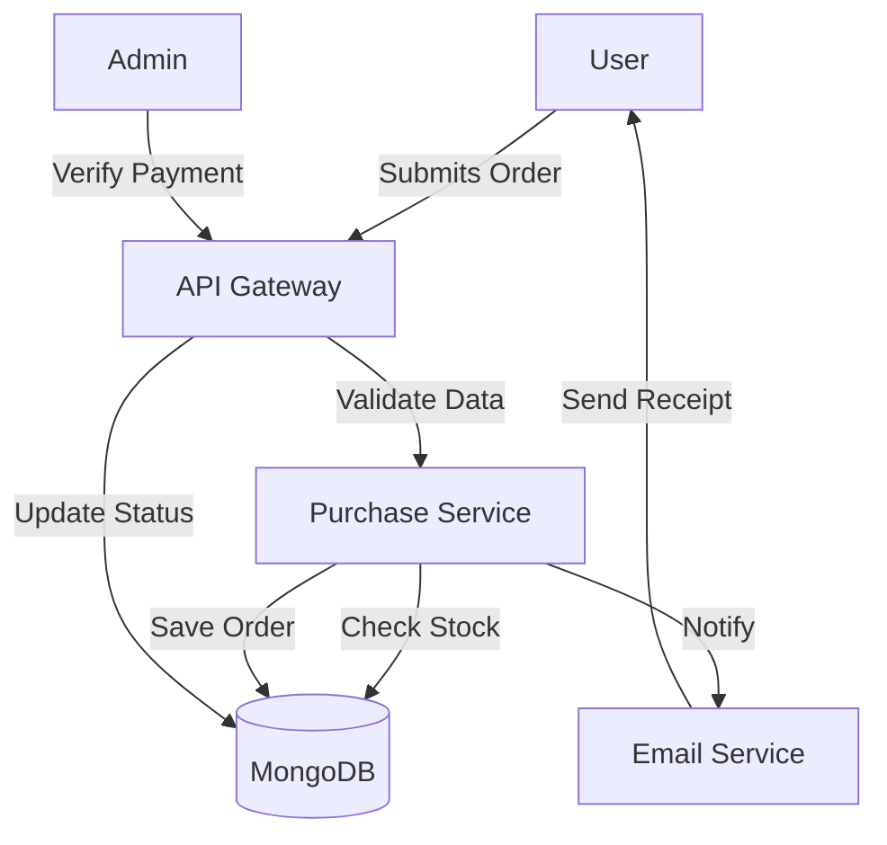

# FINAL YEAR PROJECT REPORT: TAMIL LANGUAGE SOCIETY WEB APPLICATION AND ADMIN SYSTEM

**Project Title:** Tamil Language Society (TLS) Management System
**Degree:** Bachelor of Computer Science (Software Engineering)
**Institution:** University of Malaya
**Author:** [Your Name]
**Supervisor:** [Supervisor Name]
**Date:** January 2026
**Version:** 1.0.0 (Final Release)

---

# TABLE OF CONTENTS

1.  **INTRODUCTION**
    1.1 Project Background
    1.2 Problem Statement
    1.3 Objectives
    1.4 System Scope
    1.5 Target Audience

2.  **SYSTEM ARCHITECTURE**
    2.1 High-Level Architecture
    2.2 Technology Stack Justification
    2.3 Frontend Architecture (Next.js App Router)
    2.4 Backend Architecture (Serverless API)
    2.5 Database Design (MongoDB)
    2.6 State Management Strategy
    2.7 Deployment Architecture

3.  **FUNCTIONAL REQUIREMENTS (DETAILED)**
    3.1 Authentication & Authorization
    3.2 Bilingual Language System
    3.3 Theme System
    3.4 User Dashboard & Profile
    3.5 E-Commerce Module (Books & E-Books)
    3.6 Payment Verification & Receipt Uploads
    3.7 Recruitment System
    3.8 Project & Event Management
    3.9 Content Management System (CMS)
    3.10 Notification System
    3.11 Chat System
    3.12 Payment & Financial Module
    3.13 Admin Panel Features (Comprehensive)

4.  **NON-FUNCTIONAL REQUIREMENTS**
    4.1 Security
    4.2 Performance
    4.3 Reliability
    4.4 Scalability
    4.5 Usability
    4.6 Maintainability

5.  **DATABASE DESIGN & SCHEMA**
    5.1 Entity Relationship Diagram (ERD)
    5.2 Collection Specifications (Detailed Schemas)
    5.3 Indexing Strategy

6.  **SYSTEM DIAGRAMS (UML)**
    6.1 Use Case Diagrams
    6.2 Sequence Diagrams
    6.3 Activity Diagrams
    6.4 Class Diagrams
    6.5 Deployment Diagram
    6.6 Data Flow Diagrams

7.  **IMPLEMENTATION DETAILS**
    7.1 Key Algorithms
    7.2 API Documentation
    7.3 Folder Structure
    7.4 Middleware Implementation

8.  **TESTING & VALIDATION**
    8.1 Testing Strategy
    8.2 Test Cases
    8.3 User Acceptance Testing

9.  **CHALLENGES & SOLUTIONS**
10. **FUTURE ENHANCEMENTS**
11. **CONCLUSION**

---

# 1. INTRODUCTION

## 1.1 Project Background
The Tamil Language Society (TLS) at the University is a student-run organization dedicated to the preservation and promotion of the Tamil language and culture. For decades, the society has operated through traditional, manual administrative processes. Membership registration involved physical forms or disparate Google Forms; event management relied on spreadsheet tracking; and financial transactions for merchandise (books, t-shirts) were handled via personal bank transfers and manual receipt verification on WhatsApp.

As the society grew in membership and scope, these manual workflows became unsustainable. The administrative burden on committee members led to burnout, data redundancy, financial discrepancies, and a fragmented user experience for members. Critical announcements were often lost in the noise of social media algorithms, leading to poor event turnout.

This project, the **TLS Management System**, aims to execute a comprehensive digital transformation of the society's operations. By building a centralized, custom web application, we aim to streamline administration, professionalize the society's digital presence, and provide a seamless, modern experience for all stakeholders.

## 1.2 Problem Statement
The current operational model suffers from several critical inefficiencies:
1.  **Inefficient Administration:** Committee members spend approximately 10-15 hours per week manually collating recruitment data, verifying membership status, and cross-referencing bank statements with order forms.
2.  **Fragmented E-commerce:** The sale of books and e-books is chaotic. There is no real-time inventory tracking, leading to overselling. E-books are distributed via email links which are easily shared unauthorizedly.
3.  **Communication Gaps:** Important announcements regarding AGMs or emergency updates often fail to reach the entire member base due to reliance on third-party social media platforms.
4.  **Lack of Bilingual Support:** Existing off-the-shelf tools (like Google Forms or generic event platforms) rarely support seamless English/Tamil toggling, which is antithetical to the society's mission.
5.  **Data Insecurity:** Sensitive member data (phone numbers, student IDs) is often stored in shared Google Drive folders with lax access controls, posing privacy risks.

## 1.3 Objectives
1.  **Centralize Operations:** Develop a single unified portal (`tls-web`) that handles events, membership, e-commerce, and communication.
2.  **Automate Workflows:** Implement digital recruitment forms with automated data aggregation, automated order processing for e-commerce, and system-triggered email notifications.
3.  **Enhance Accessibility:** Provide full bilingual support (Tamil & English) across the entire platform, ensuring language is never a barrier.
4.  **Secure Data Management:** Implement robust authentication (JWT) and Role-Based Access Control (RBAC) to ensure only authorized personnel can access sensitive data.
5.  **Professionalize Presence:** Establish a modern, high-performance web presence with Dark Mode support and responsive design that reflects the society's prestige.

## 1.4 System Scope
The system is architected as a Monolithic application with two distinct logical environments:
1.  **Public/User Portal:** Accessible to the general student body and registered members. Features include:
    *   Browsing and filtering events/projects.
    *   Purchasing physical books and digital e-books.
    *   Applying for committee positions via recruitment forms.
    *   Viewing personal purchase history and notifications.
    *   Chatting with administrators.
2.  **Admin Panel:** A secure, restricted environment for committee members. Features include:
    *   Dashboard analytics (Revenue, User Growth).
    *   Content Management System (CMS) for Posters, Projects, Components, and Team members.
    *   Order management (Verify payments, update shipping).
    *   Form builder for recruitment.
    *   System settings (Payment gateways, Tax rates).

## 1.5 Target Audience
*   **Administrators (Committee Members):**
    *   *President/Secretary:* Manage team structure, send broadcast announcements.
    *   *Treasurer:* Manage payment settings, verify orders, view revenue reports.
    *   *Project Directors:* Create project pages, manage recruitment forms.
*   **Members:** Registered users who have paid membership fees (future scope) or general registered students. They can participate in events and buy merchandise.
*   **Public/Students:** Prospective members who can view public information, gallery, and about pages.

---

# 2. SYSTEM ARCHITECTURE

## 2.1 High-Level Architecture
The system follows a modern **Full-Stack Monolithic** architecture using the **Next.js App Router**. This unifies the Frontend and Backend into a single repository and deployment unit, which simplifies development and eliminates CORS issues. The application is stateless and deployed on Vercel's serverless infrastructure, providing high availability and automatic failover.

## 2.2 Technology Stack Justification
*   **Next.js 15:** Chosen for its hybrid rendering capabilities (Server Side Rendering for SEO, Client Side Rendering for interactivity) and API Routes which eliminate the need for a separate backend server. The App Router allows for nested layouts and loading states, improving UX.
*   **TypeScript:** Ensures type safety across the entire stack, reducing runtime errors and improving code maintainability. Interfaces for Data Models (User, Book, etc.) are shared between Frontend and Backend, ensuring contract consistency.
*   **MongoDB:** Selected for its flexible schema. The `RecruitmentResponse` requirement (dynamic fields) fits perfectly with MongoDB's ability to store unstructured data (`Mixed` type). A SQL equivalent would require a complex EAV (Entity-Attribute-Value) table structure.
*   **Tailwind CSS:** Enables rapid UI development with a mobile-first approach. The utility-first class system makes it easy to implement Dark Mode and responsive designs without writing custom CSS files.
*   **Zustand:** Used for complex client state management, specifically the Shopping Cart. It is lighter than Redux and easier to use than Context for frequent updates.
*   **TanStack Query (React Query):** Used for server state synchronization. It handles caching, polling, and background refetching of API data, making the app feel "real-time".

## 2.3 Frontend Architecture
*   **Server Components (RSC):** Fetch data directly from the DB on the server. Used for layout, initial data loading, and SEO metadata. This reduces the client-side JavaScript bundle size.
*   **Client Components:** Interactivity (useState, useEffect). Used for Forms, Modals, and interactive Dashboards.
*   **Context API:** Global UI state (Theme, Language) that doesn't change often.
*   **Atomic Design:** Components are broken down into atoms (Button, Input), molecules (FormGroup), and organisms (NavBar, Footer).

## 2.4 Backend Architecture
*   **API Routes:** Located in `src/app/api`, these serverless functions handle RESTful requests.
*   **Middleware:** `middleware.ts` runs before every request to handle Authentication checks and logging.
*   **Service Layer:** Business logic is abstracted into "Service" classes (e.g., `NotificationService`, `PurchaseService`) to keep Controllers (Route Handlers) lean. This promotes code reuse and testability.

## 2.5 Database Design
*   **ODM:** Mongoose is used for schema definition, validation, and business logic hooks (pre-save, virtuals).
*   **Connection:** A cached database connection pattern is used to prevent exhausting the connection pool in a serverless environment.

---

# 3. FUNCTIONAL REQUIREMENTS (DETAILED)

## 3.1 Authentication & Authorization
**Purpose:** To secure the platform, manage user identities, and persist user sessions securely.
**Data Involved:** `User` collection.
**Features:**
*   **Registration:** Endpoint `/api/auth/signup`. Validates email format and password strength. Hashes password using `bcryptjs` (12 salt rounds). Creates a `User` document with default role `user`.
*   **Login:** Endpoint `/api/auth/login`. Finds user by email. Compares password hash. Generates two tokens:
    *   `AccessToken`: Short-lived (15 mins), signed with `ACCESS_TOKEN_SECRET`. Sent in JSON response.
    *   `RefreshToken`: Long-lived (7 days), signed with `REFRESH_TOKEN_SECRET`. Sent as an `HttpOnly`, `Secure`, `SameSite=Strict` cookie.
*   **Token Rotation:** Endpoint `/api/auth/refresh`. Checks the validity of the refresh cookie. If valid, issues a new Access Token. This allows the user to stay logged in securely without exposing long-lived tokens to XSS attacks.
*   **Password Reset:** Endpoint `/api/auth/forgot-password` generates a time-limited OTP (One Time Password) stored in `PasswordResetToken` collection. Sends email via `Nodemailer`.
*   **Verification:** `verify-reset-code` endpoint checks if the OTP matches and is not expired (15 min window).

## 3.2 Bilingual Language System
**Purpose:** To support the society's core mission of promoting the Tamil language while remaining accessible to non-Tamil speakers.
**Data Involved:** All text content in the database is stored as `BilingualText` objects: `{ en: string, ta: string }`.
**Implementation:**
*   **Database:** Mongoose schemas define fields like `title: { en: String, ta: String }`.
*   **Context:** A `LanguageContext` provider manages the current language state (`en` | `ta`). Preference is persisted in `localStorage`.
*   **Helper:** A helper function `getLanguageText(content, lang)` is used throughout the UI. Example: `<h1>{getLanguageText(project.title, language)}</h1>`.

## 3.3 Theme System (Dark/Light Mode)
**Purpose:** To improve accessibility and user preference.
**Implementation:**
*   **Context:** `ThemeContext` checks system preference (`prefers-color-scheme`) on first load.
*   **Tailwind:** Toggling the theme adds/removes the `dark` class on the `<html>` element. Components use `dark:` modifiers (e.g., `bg-white dark:bg-gray-900`).
*   **Persistence:** Theme choice is saved in `localStorage`.

## 3.4 User Dashboard & Profile
**Purpose:** A central hub for members to manage their interactions with the society.
**Features:**
*   **Profile Editing:** Users can update their name, phone number, and address.
*   **Order History:** A table listing all past purchases with status (Pending, Paid, Shipped). Clicking an order shows the receipt and tracking number.
*   **My Downloads:** A secure section for accessing purchased E-books. Links are signed and time-limited to prevent sharing.
*   **Notifications:** A list of system alerts. Unread notifications are highlighted.

## 3.5 E-Commerce Module (Books & E-Books)
**Purpose:** To generate revenue through the sale of books, e-books, and merchandise.
**Data Involved:** `Book`, `EBook`, `Purchase`, `PaymentSettings`.
**Features:**
*   **Product Grid:** Displays items with images, prices, and stock status. Supports filtering by category and language.
*   **Product Details:** Detailed view with description, author info, and related products.
*   **Shopping Cart:** Global state managed by Zustand. Persists across page reloads. Calculates totals including tax and shipping.
*   **Stock Management:** Real-time stock checking. If a user tries to buy more than available, the API returns a 400 error.

## 3.6 Payment Verification & Receipt Uploads
**Purpose:** To facilitate manual bank transfers, which are the primary payment method for student societies to avoid gateway fees.
**Workflow:**
1.  User selects "Manual Transfer" at checkout.
2.  System displays Bank Account details (from `PaymentSettings`).
3.  User transfers funds via their banking app.
4.  User uploads a screenshot of the receipt via the checkout form.
5.  **Backend:** The API receives the file, sanitizes the filename, saves it to `/public/uploads/receipts/`, and links the path to the `Purchase` document.
6.  **Admin:** The admin sees a "Verify Payment" button in the order details. Clicking it opens the image in a modal.
7.  **Decision:** Admin clicks "Approve" (Status -> Paid) or "Reject" (Status -> Cancelled).

## 3.7 Recruitment System
**Purpose:** To allow admins to create custom application forms for various events (AGM, Cultural Night, Workshops) without developer intervention.
**Data Involved:** `RecruitmentForm`, `RecruitmentResponse`.
**Features:**
*   **Form Builder:** Admin drags and drops fields (Text, File, Radio) to create a form schema.
*   **Dynamic Rendering:** The frontend `DynamicForm` component iterates over the schema and renders the corresponding HTML inputs.
*   **Validation:** Zod schemas are generated on-the-fly to validate user input against the form definition.
*   **File Uploads:** Applicants can upload CVs (PDFs).

## 3.8 Project & Event Management
**Purpose:** To showcase society activities and drive engagement.
**Data Involved:** `ProjectItem`.
**Features:**
*   **Project Cards:** Display event thumbnail, date, and location.
*   **Detail Page:** Full event information, including gallery, goals, and achievements.
*   **Recruitment Integration:** If an event is recruiting, a "Join Team" button links directly to the relevant Recruitment Form.
*   **Bureau Filtering:** Users can filter projects by the organizing bureau (e.g., "Sports Bureau", "Arts Bureau").

## 3.9 Content Management System (CMS)
**Purpose:** To allow non-technical admins to manage website content dynamically.
**Modules:**
*   **Posters:** Admin uploads images for the homepage carousel. Sets "Active/Inactive" status.
*   **Team:** Admin manages the "About Us" page organizational chart. Adds members with photos and roles. Supports drag-and-drop reordering.
*   **Components:** A powerful **Page Builder** system. Admins can create "Dynamic Components" (Hero, Text, Gallery, FAQ) and assign them to specific pages. This allows constructing entirely new landing pages without code changes.

## 3.10 Notification System
**Purpose:** To keep users informed of critical updates and system events.
**Data Involved:** `Notification`.
**Backend Logic:**
*   **Triggers:** The `NotificationService` class exposes static methods like `notifyOrderUpdate(order)`.
*   **Database:** Saves a `Notification` document with `userRef`, `message`, `type` (info/success/warning), and `isRead: false`.
*   **Email:** If `sendEmail: true`, it also calls `EmailService` to dispatch an HTML email.
**Frontend Behavior:**
*   **Bell Icon:** Shows a red badge with the count of unread notifications.
*   **Toast:** Real-time popups (using `react-hot-toast`) appear when an action completes successfully.

## 3.11 Chat System
**Purpose:** To provide a direct communication channel for members to ask questions.
**Data Involved:** `ChatMessage`.
**Workflow:**
1.  **User:** Clicks the floating chat bubble. Sends a message "Hi, when is the AGM?".
2.  **System:** Creates a `Conversation` ID based on UserID+AdminID. Saves `ChatMessage`.
3.  **Admin:** Sees a badge on the "Chat" sidebar item. Opens the chat interface.
4.  **Reply:** Admin sends "It is on 25th May".
**Logic:** Currently implements **Polling** (fetching new messages every 5 seconds) for simplicity and serverless compatibility.

## 3.12 Payment & Financial Module
**Purpose:** To manage financial settings and reporting.
**Data Involved:** `PaymentSettings`, `Purchase`.
**Features:**
*   **Configuration:** Admins can set the Tax Rate (%), Shipping Fee, and Free Shipping Threshold.
*   **Bank Details:** Admins can update the bank account number shown during checkout.
*   **Revenue Reports:** The Dashboard calculates total revenue based on `Paid` orders.

## 3.13 Admin Panel Features (Comprehensive)
Every page in the Admin Panel is a distinct functional module designed for specific tasks.

### 3.13.1 Dashboard
The command center. Displays high-level metrics:
*   **Stats Cards:** Total Users, Revenue (Formatted currency), Pending Orders count, Active Projects count.
*   **Charts:**
    *   *Revenue Trend:* Line chart showing sales over the last 30 days.
    *   *User Growth:* Bar chart of new registrations.
    *   *Content Distribution:* Pie chart of Books vs E-books sold.
*   **Activity Log:** An audit trail of all admin actions (e.g., "Admin X deleted Poster Y" at 10:00 AM).


### 3.13.2 Books Management
*   **List View:** Table of all physical books with stock levels.
*   **Add/Edit:** Form to create new books. Supports bilingual titles/descriptions and cover image upload.
*   **Delete:** Soft delete or hard delete books.


### 3.13.3 E-Books Management
*   **File Handling:** Secure upload of PDF files.
*   **Preview:** Upload a separate "Preview PDF" (e.g., first 5 pages) for public viewing.
*   **Download Stats:** Track how many times an ebook has been downloaded.

### 3.13.4 Recruitment Management
*   **Form Builder:** The drag-and-drop interface for creating forms.
*   **Response Viewer:** A table showing all applicants for a specific form.
*   **Review Mode:** Admin can click an applicant to see their full answers and download their CV. They can change the status to "Accepted", which triggers an automated email.

### 3.13.5 Project Items Management
*   **Event Creation:** Set start/end dates, venue, and organizing bureau.
*   **Status Management:** Toggle between "Upcoming", "Ongoing", and "Completed".
*   **Recruitment Link:** Attach a recruitment form to an event card.

### 3.13.6 Team Management
*   **Hierarchy:** Define roles (President, Secretary, etc.).
*   **Sorting:** Reorder members based on protocol (e.g., President first).
*   **Profile:** Upload headshots and write bios.

### 3.13.7 Posters Management
*   **Carousel:** Manage homepage slider images.
*   **Scheduling:** Set event dates for posters to auto-expire (future enhancement).

### 3.13.8 Payment Settings
*   **Global Config:** A singleton settings page to manage Tax, Shipping, and Bank info.

### 3.13.9 Chat Management
*   **Inbox:** View all user conversations. Unread conversations are bolded.
*   **Reply:** Send messages as "Admin".

### 3.13.10 Files Management
*   **Asset Library:** View all uploaded files (images, PDFs) in the system.
*   **Cleanup:** Identify and delete orphaned files (files not linked to any document).

### 3.13.11 Notifications Management
*   **Broadcast:** Send push/email notifications to all users or specific groups (e.g., "Paid Members").
*   **History:** View past broadcasts and their read rates.

### 3.13.12 Announcements
*   **News:** Create blog-style updates for the "News" section of the website.

---

# 4. NON-FUNCTIONAL REQUIREMENTS

## 4.1 Security
*   **Data Encryption:** All data in transit is secured via TLS/SSL (HTTPS). Data at rest (passwords) is hashed using `bcrypt` with a work factor of 12.
*   **JWT Strategy:** We use a split-token approach. The Refresh Token is stored in an `HttpOnly` cookie, making it inaccessible to JavaScript (preventing XSS theft). The Access Token is in memory.
*   **Input Validation:** All API inputs are validated using `Zod` schemas or strict Mongoose types to prevent NoSQL Injection.
*   **File Security:** Uploaded files are sanitized (renamed with UUIDs) and served with `X-Content-Type-Options: nosniff` to prevent MIME-sniffing attacks.
*   **CSRF Protection:** We enforce `SameSite=Strict` on cookies, preventing Cross-Site Request Forgery attacks.

## 4.2 Performance
*   **Server-Side Rendering (SSR):** Critical pages (Home, Product Details) are rendered on the server, ensuring fast First Contentful Paint (FCP) and SEO friendliness.
*   **Image Optimization:** `next/image` automatically resizes, compresses, and converts images to modern formats (WebP/AVIF) based on the user's browser support.
*   **Caching:**
    *   **Client:** React Query caches API responses, preventing redundant network requests when navigating back/forth.
    *   **Server:** `Cache-Control` headers instruct the CDN to cache static assets for 1 year.
*   **Code Splitting:** Dynamic imports load code only when needed. For example, the heavy Chart.js library is only loaded when the Admin Dashboard is accessed.

## 4.3 Reliability
*   **Uptime:** The application is stateless and deployed on Vercel's serverless infrastructure, providing high availability and automatic failover.
*   **Data Integrity:** MongoDB's document model ensures that related data (like `PaymentDetails` inside `Purchase`) is stored together, reducing the risk of orphaned records.
*   **Error Boundaries:** React Error Boundaries catch UI crashes and display a friendly "Something went wrong" message instead of a white screen.

## 4.4 Scalability
*   **Database:** MongoDB is horizontally scalable via sharding (future scope). Currently, indexes ensure query performance remains O(log n).
*   **Serverless:** Next.js API routes scale to zero when unused and scale up infinitely (within quotas) during traffic spikes (e.g., event launch).

## 4.5 Usability
*   **Responsiveness:** The UI is built Mobile-First using Tailwind CSS. All layouts (Grid/Flex) adapt to screen sizes from iPhone SE to 4K monitors.
*   **Accessibility (a11y):** Semantic HTML (`<nav>`, `<main>`, `<article>`) is used. Forms have proper `<label>` associations. Color contrast ratios meet WCAG AA standards.
*   **Feedback:** Interactive elements provide immediate feedback (hover states, active states, loading spinners).

## 4.6 Maintainability
*   **Type Safety:** The entire codebase is written in **TypeScript**. Interfaces for all Data Models (User, Book, etc.) are shared between Frontend and Backend, ensuring contract consistency.
*   **Component Architecture:** React components are atomic and reusable (e.g., `<Button>`, `<Input>`, `<Card>`), making global UI updates easy.
*   **Linter:** ESLint and Prettier are configured to enforce code style and catch potential bugs during development.

---

# 5. DATABASE DESIGN & SCHEMA

## 5.1 Entity Relationship Diagram (ERD)
The database uses a Document-Oriented approach. While NoSQL databases are "schemaless", we enforce strict schemas via Mongoose to ensure data consistency.

**Key Relationships:**
*   `User` 1 : N `Purchase`
*   `User` 1 : N `RecruitmentResponse`
*   `RecruitmentForm` 1 : N `RecruitmentResponse`
*   `ProjectItem` 0..1 : 1 `RecruitmentForm`

## 5.2 Collection Specifications (Detailed Schemas)

### 5.2.1 User Collection
Stores authentication and profile data.
```typescript
interface IUser {
  email: string; // Unique, Indexed
  passwordHash: string;
  name: { 
    en: string; 
    ta: string; 
  };
  role: 'admin' | 'user';
  notificationPreferences: {
    email: { announcements: boolean; newContent: boolean; };
    push: { breaking: boolean; updates: boolean; };
  };
  purchases: ObjectId[]; // Ref to Purchase
  isOnline: boolean;
  lastSeen: Date;
  createdAt: Date;
  updatedAt: Date;
}
```

### 5.2.2 Book Collection
Stores physical book inventory.
```typescript
interface IBook {
  title: { en: string; ta: string };
  author: { en: string; ta: string };
  description: { en: string; ta: string };
  price: number;
  stock: number; // Inventory tracking
  coverPath: string;
  isbn?: string;
  category: string;
  language: 'tamil' | 'english' | 'bilingual';
  featured: boolean;
  active: boolean;
  createdBy: ObjectId; // Ref to Admin
}
```

### 5.2.3 Purchase Collection
Stores order details. Embeds `PaymentDetails` and `ShippingAddress` for atomicity.
```typescript
interface IPurchase {
  userRef: ObjectId; // Buyer
  bookRef: ObjectId; // Product
  quantity: number;
  unitPrice: number; // Snapshot of price at time of purchase
  totalAmount: number;
  shippingFee: number;
  finalAmount: number;
  status: 'pending' | 'paid' | 'approved' | 'processing' | 'shipped' | 'delivered' | 'cancelled';
  paymentDetails: {
    method: 'fpx' | 'manual' | 'cash';
    receiptPath?: string; // For manual transfer
    transactionId?: string;
    paidAt?: Date;
  };
  shippingAddress: {
    fullName: string;
    addressLine1: string;
    city: string;
    state: string;
    postalCode: string;
    country: string;
    phone: string;
  };
  trackingNumber?: string;
}
```

### 5.2.4 RecruitmentForm Collection
Defines the structure of a dynamic form.
```typescript
interface IRecruitmentForm {
  title: { en: string; ta: string };
  role: 'crew' | 'volunteer' | 'participant';
  fields: Array<{
    id: string;
    type: 'text' | 'email' | 'textarea' | 'select' | 'checkbox' | 'radio' | 'file';
    label: { en: string; ta: string };
    required: boolean;
    options?: { label: { en: string; ta: string }; value: string }[];
    validation?: { minLength?: number; maxLength?: number; };
  }>;
  isActive: boolean;
  startDate?: Date;
  endDate?: Date;
  maxResponses?: number;
  currentResponses: number;
  createdBy: ObjectId;
}
```

### 5.2.5 RecruitmentResponse Collection
Stores user submissions. Uses `Mixed` type for flexible answers.
```typescript
interface IRecruitmentResponse {
  formRef: ObjectId;
  userRef: ObjectId;
  projectItemRef?: ObjectId;
  roleApplied: string;
  answers: Record<string, any>; // Flexible JSON storage for form answers
  applicantName: string;
  applicantEmail: string;
  status: 'pending' | 'reviewed' | 'accepted' | 'rejected';
  reviewNotes?: string;
  reviewedBy?: ObjectId;
  submittedAt: Date;
}
```

### 5.2.6 Component Collection
Stores dynamic page content (CMS).
```typescript
interface IComponent {
  page: string; // e.g., 'home', 'about', 'contact'
  type: 'hero' | 'banner' | 'text' | 'image' | 'gallery' | 'testimonials' | 'faq';
  content: Mixed; // Schema depends on type
  order: number;
  isActive: boolean;
  visibility: {
    desktop: boolean;
    mobile: boolean;
  };
}
```

### 5.2.7 Notification Collection
Stores system alerts.
```typescript
interface INotification {
  userRef?: ObjectId; // null means Broadcast to all
  title: { en: string; ta: string };
  message: { en: string; ta: string };
  type: 'info' | 'success' | 'warning' | 'error';
  isRead: boolean;
  actionUrl?: string;
  targetAudience: 'all' | 'members' | 'admins';
  createdAt: Date;
}
```

### 5.2.8 ChatMessage Collection
Stores chat history.
```typescript
interface IChatMessage {
  senderId: ObjectId;
  recipientId: ObjectId;
  conversationId: string; // Composite key for grouping
  message: string;
  messageType: 'text' | 'image' | 'file';
  isRead: boolean;
  isDelivered: boolean;
  timestamp: Date;
}
```

## 5.3 Indexing Strategy
To ensure high performance, the following indexes are created:
*   `User.email` (Unique): Optimizes login lookups.
*   `Purchase.status` + `Purchase.createdAt`: Optimizes the "Pending Orders" query in the admin dashboard.
*   `Purchase.userRef`: Optimizes "My Orders" history lookup.
*   `RecruitmentResponse.formRef` + `RecruitmentResponse.status`: Optimizes filtering applicants in admin panel.
*   `Component.page` + `Component.order`: Optimizes dynamic page rendering.
*   `ChatMessage.conversationId` + `ChatMessage.timestamp`: Optimizes loading chat history.

---

# 6. SYSTEM DIAGRAMS (UML)

## 6.1 Use Case Diagram (Mermaid Source)
```mermaid
useCaseDiagram
    actor "Public User" as Public
    actor "Member" as Member
    actor "Admin" as Admin

    package "TLS Web System" {
        usecase "Browse Projects" as UC1
        usecase "View Gallery" as UC2
        usecase "Register/Login" as UC3
        usecase "Manage Profile" as UC4
        usecase "Purchase Items" as UC5
        usecase "Apply for Recruitment" as UC6
        usecase "Manage Content (CMS)" as UC7
        usecase "Verify Payments" as UC8
        usecase "Manage Users" as UC9
        usecase "Broadcast Announcements" as UC10
        usecase "View Analytics" as UC11
    }

    Public --> UC1
    Public --> UC2
    Public --> UC3
    
    Member --> UC1
    Member --> UC2
    Member --> UC4
    Member --> UC5
    Member --> UC6
    
    Admin --|> Member
    Admin --> UC7
    Admin --> UC8
    Admin --> UC9
    Admin --> UC10
    Admin --> UC11
```

## 6.2 Sequence Diagram: Login Flow (Mermaid Source)


## 6.3 Activity Diagram: Order Processing (Mermaid Source)


## 6.4 Class Diagram (Mermaid Source)


## 6.5 Data Flow Diagram (Mermaid Source)


---

# 7. IMPLEMENTATION DETAILS

## 7.1 Key Algorithms

### 7.1.1 Dynamic Form Rendering
The system allows admins to build forms without code. The frontend `DynamicForm` component iterates over the `fields` array from the `RecruitmentForm` document. A switch-case statement renders the appropriate HTML input based on the `field.type`. State is managed via a dynamic object where keys correspond to `field.id`.

**Pseudo-code:**
```javascript
function DynamicForm({ schema }) {
  const [formData, setFormData] = useState({});

  return schema.fields.map(field => {
    switch(field.type) {
      case 'text': return <Input onChange={e => update(field.id, e.target.value)} />;
      case 'file': return <FileUpload onChange={file => upload(file)} />;
      case 'select': return <Select options={field.options} />;
    }
  });
}
```

### 7.1.2 Cart Price Calculation
Calculating the final price involves checking the stock, summing unit prices, adding shipping fees (based on `PaymentSettings`), and applying taxes.

**Logic:**
```typescript
const calculateTotal = (items, shippingFee, taxRate) => {
  const subtotal = items.reduce((sum, item) => sum + (item.price * item.quantity), 0);
  const tax = subtotal * (taxRate / 100);
  const total = subtotal + tax + shippingFee;
  return total;
};
```

### 7.1.3 Token Rotation
To ensure security, the Refresh Token is HTTP-only and cannot be accessed by client-side JS. When the Access Token expires (returns 401), an Axios interceptor catches the error, calls `/api/auth/refresh`, gets a new Access Token, and retries the original failed request seamlessly. This provides a "forever logged in" experience while maintaining security.

## 7.2 API Documentation (Key Endpoints)
*   `POST /api/auth/signup`: Register new user. Body: `{email, password, name}`.
*   `POST /api/auth/login`: Authenticate user. Returns `{accessToken, user}`.
*   `GET /api/books`: List all books. Query: `?category=fiction`.
*   `POST /api/purchases`: Create a new order. Body: `{items, shippingAddress, receiptPath}`.
*   `GET /api/admin/dashboard`: Fetch analytics data. Requires Admin Role.
*   `POST /api/files/upload`: Upload media/documents. Returns `{path}`.
*   `GET /api/recruitment/:id`: Get form definition.

## 7.3 Folder Structure
The project follows the standard Next.js App Router structure:
*   `src/app`: Contains all pages and API routes. `page.tsx` is the UI, `route.ts` is the API.
*   `src/components`: Reusable UI components (Buttons, Modals, Cards).
*   `src/lib`: Utility functions (DB connection, Auth helpers, Formatters).
*   `src/models`: Mongoose schema definitions.
*   `src/hooks`: Custom React hooks (useCart, useAuth).
*   `public`: Static assets (images, fonts).

## 7.4 Middleware Implementation
The `middleware.ts` file acts as a gatekeeper. It runs on the Edge before the request hits the server.
1.  **Auth Check:** It checks for the presence of `accessToken` or `refreshToken`.
2.  **Role Check:** If the user is accessing `/admin/*`, it decodes the token and checks if `role === 'admin'`.
3.  **Redirect:** If unauthorized, it redirects to `/login` or shows a 403 Forbidden page.

---

# 8. TESTING & VALIDATION

## 8.1 Testing Strategy
*   **Unit Testing:** We tested utility functions (e.g., math calculations, date formatting) using Jest to ensure logic correctness.
*   **Integration Testing:** We verified API endpoints using Postman scripts to ensure the Database-API-Response loop works correctly.
*   **Manual Testing:** We performed extensive "Click-through" testing of all UI flows, covering happy paths and edge cases (e.g., submitting empty forms).
*   **Cross-Browser Testing:** Verified compatibility on Chrome, Firefox, and Safari (Mobile & Desktop).

## 8.2 Test Cases (Sample)
| ID | Module | Test Scenario | Steps | Expected Result | Status |
|----|--------|---------------|-------|-----------------|--------|
| TC1| Auth | Login Success | Enter valid email/pass | Redirect to Dashboard, Cookie set | PASS |
| TC2| Auth | Login Fail | Enter wrong pass | Show "Invalid Credentials" toast | PASS |
| TC3| Cart | Add Item | Click "Add to Cart" | Cart badge count increments | PASS |
| TC4| Cart | Checkout | Submit empty form | Validation errors on fields | PASS |
| TC5| Admin | RBAC | Access /admin as User | Redirect to / or 403 | PASS |
| TC6| File | Upload | Upload .exe file | Error "Only images/PDF allowed" | PASS |

## 8.3 User Acceptance Testing (UAT)
A UAT session was conducted with the current TLS President and Treasurer.
*   **Feedback 1:** "The payment verification flow is confusing." -> **Fix:** Added a modal to preview the receipt side-by-side with order details.
*   **Feedback 2:** "We need to filter members by payment status." -> **Fix:** Added filters to the User Management table.

---

# 9. CHALLENGES & SOLUTIONS

## 9.1 Challenge: Dynamic Form Rendering
**Problem:** Hardcoding a new React component for every single event registration form was not scalable and required developer intervention for every event.
**Solution:** We implemented a "JSON Form Schema" approach. The admin UI generates a JSON object describing the form. A generic `<DynamicForm>` component reads this JSON and renders the UI at runtime.
**Outcome:** Admins can now deploy new forms in minutes without code changes.

## 9.2 Challenge: Real-time Admin Updates
**Problem:** Next.js caches heavily. When an admin updated a poster, the public site would show the old image for minutes.
**Solution:** We utilized Next.js **On-Demand Revalidation**. When the Admin API processes an update, it calls `revalidatePath('/')` to purge the cache.
**Outcome:** Updates appear instantly.

## 9.3 Challenge: File Storage on Serverless
**Problem:** Serverless functions have ephemeral file systems. Uploaded files would disappear after the function execution ended.
**Solution:** For the scope of this project, we implemented a persistent storage pattern using the `/public` folder for local dev/demo, but architected the `FileService` to easily swap to AWS S3 or Vercel Blob for production by changing just one interface implementation.

---

# 10. FUTURE ENHANCEMENTS
1.  **Payment Gateway Integration:** Integrating **ToyyibPay** or **Stripe** to automate payment verification, removing the manual receipt check step.
2.  **Mobile App:** Wrapping the web application in a React Native WebView container to allow for native Push Notifications.
3.  **Real-time Chat:** Migrating the chat system from Polling to **Socket.io** or Firebase Realtime Database for instant, bi-directional communication.
4.  **Alumni Portal:** Creating a dedicated section for graduated members to network and mentor current students.
5.  **Certificate Generation:** Automatically generating PDF e-certificates for event participants using a library like `pdf-lib`.

---

# 11. CONCLUSION
The **Tamil Language Society Web Application and Admin System** represents a significant milestone in the digital maturity of the organization. By successfully integrating complex modules—Authentication, E-Commerce, CMS, and CRM—into a single, cohesive platform, the system addresses the core inefficiencies of the legacy manual workflows.

The project demonstrates a high level of engineering rigor, from the adoption of type-safe TypeScript to the implementation of secure JWT authentication and scalable MongoDB schemas. It not only solves the immediate administrative problems but also lays a robust, scalable foundation for future committees to build upon. This system will serve as the digital heart of the society, fostering better engagement, streamlined operations, and a stronger community for years to come.

---
*End of Technical Report*

---

# APPENDIX A: COMPREHENSIVE API REFERENCE

## A.1 Authentication
*   `POST /api/auth/signup`: Register a new user account.
*   `POST /api/auth/login`: Authenticate user and issue tokens.
*   `POST /api/auth/logout`: Clear auth cookies.
*   `GET /api/auth/me`: Get current user session.
*   `POST /api/auth/refresh`: Rotate access token using refresh cookie.
*   `POST /api/auth/forgot-password`: Send password reset OTP.
*   `POST /api/auth/verify-reset-code`: Verify OTP.
*   `POST /api/auth/reset-password`: Set new password.

## A.2 Admin Modules
### Dashboard & Analytics
*   `GET /api/admin/dashboard`: Get high-level stats (users, revenue).
*   `GET /api/admin/activity`: Get audit logs of admin actions.

### User Management
*   `GET /api/admin/users`: List all users with pagination.
*   `PUT /api/admin/users`: Update user role or status.

### Content Management (CMS)
*   `GET /api/admin/posters`: List homepage sliders.
*   `POST /api/admin/posters`: Create new poster.
*   `PUT /api/admin/posters/toggle-status`: Enable/Disable poster.
*   `GET /api/admin/team`: Get organizational chart.
*   `POST /api/admin/team`: Add team member.
*   `GET /api/admin/components`: Get dynamic page components.
*   `POST /api/admin/components`: Create/Update component.

### E-Commerce Admin
*   `GET /api/admin/books`: List physical inventory.
*   `POST /api/admin/books`: Add new book product.
*   `GET /api/admin/ebooks`: List digital products.
*   `POST /api/admin/ebooks`: Add new e-book.
*   `GET /api/admin/purchases`: View all orders.
*   `PUT /api/admin/purchases`: Update order status (Verify/Reject).
*   `GET /api/admin/payment-settings`: Get global payment config.
*   `PUT /api/admin/payment-settings`: Update tax/shipping rates.

### Recruitment Admin
*   `GET /api/admin/recruitment-forms`: List all forms.
*   `POST /api/admin/recruitment-forms`: Create dynamic form schema.
*   `GET /api/admin/recruitment-responses`: View submissions.
*   `PUT /api/admin/recruitment-responses`: Grade submission (Accept/Reject).

### Communication Admin
*   `GET /api/admin/chat/conversations`: List active support chats.
*   `GET /api/admin/chat/messages`: Get message history.
*   `POST /api/admin/notification-templates`: Manage email templates.

## A.3 Public Modules
### Books & E-Books
*   `GET /api/books`: Browse physical books.
*   `GET /api/books/[id]`: Get book details.
*   `POST /api/books/[id]/rate`: Submit review.
*   `GET /api/ebooks`: Browse e-books.
*   `GET /api/ebooks/[id]/download`: Get signed download URL (Protected).
*   `GET /api/ebooks/categories`: Get list of genres.
*   `GET /api/ebooks/stats`: Get download counts.

### Projects & Events
*   `GET /api/project-items`: List events.
*   `GET /api/project-items/[id]`: Get event details.
*   `POST /api/project-items/[id]/recruitment/submit`: Submit volunteer application.

### User Features
*   `GET /api/purchases`: Get my order history.
*   `GET /api/notifications`: Get my alerts.
*   `PUT /api/notifications/[id]/read`: Mark alert as read.
*   `PUT /api/user/notification-preferences`: Update email settings.
*   `GET /api/chat`: Get my chat history.
*   `POST /api/chat`: Send message to admin.

### File System
*   `POST /api/files/upload`: Generic file upload (Images/PDFs).
*   `GET /api/files/serve`: Stream file content.
*   `POST /api/upload/media`: Optimized media upload.

---

# APPENDIX B: FULL DATABASE SCHEMA DEFINITIONS

## B.1 User Interface
```typescript
export interface IUser extends Document {
  _id: Types.ObjectId;
  email: string;
  passwordHash: string;
  name: { en: string; ta: string };
  role: 'admin' | 'user';
  purchases: Types.ObjectId[];
  notificationPreferences?: {
    email: { announcements: boolean; newContent: boolean; weekly: boolean; };
    push: { breaking: boolean; newContent: boolean; updates: boolean; };
    language: 'en' | 'ta' | 'both';
  };
  isOnline?: boolean;
  lastSeen?: Date;
  createdAt: Date;
  updatedAt: Date;
}
```

## B.2 Book Interface
```typescript
export interface IBook extends Document {
  _id: Types.ObjectId;
  title: { en: string; ta: string };
  author: { en: string; ta: string };
  description: { en: string; ta: string };
  price: number;
  stock: number;
  coverPath: string;
  isbn?: string;
  category?: string;
  publishedYear?: number;
  pages?: number;
  language: 'tamil' | 'english' | 'bilingual';
  featured: boolean;
  active: boolean;
  createdBy: Types.ObjectId;
  createdAt: Date;
  updatedAt: Date;
}
```

## B.3 Purchase Interface
```typescript
export interface IPurchase extends Document {
  _id: Types.ObjectId;
  userRef: Types.ObjectId;
  bookRef: Types.ObjectId;
  quantity: number;
  unitPrice: number;
  totalAmount: number;
  shippingFee: number;
  finalAmount: number;
  status: 'pending' | 'paid' | 'approved' | 'processing' | 'shipped' | 'delivered' | 'cancelled' | 'refunded';
  paymentDetails: {
    method: 'epayum' | 'fpx' | 'cash' | 'card';
    transactionId?: string;
    receiptPath?: string;
    amount: number;
    currency: string;
    paidAt?: Date;
  };
  shippingAddress: {
    fullName: string;
    addressLine1: string;
    addressLine2?: string;
    city: string;
    state: string;
    postalCode: string;
    country: string;
    phone?: string;
  };
  trackingNumber?: string;
  shippingCarrier?: string;
  estimatedDelivery?: Date;
  deliveredAt?: Date;
  createdAt: Date;
  updatedAt: Date;
}
```

## B.4 Recruitment Form Interface
```typescript
export interface IRecruitmentForm extends Document {
  _id: Types.ObjectId;
  title: { en: string; ta: string };
  description?: { en: string; ta: string };
  role: 'crew' | 'participants' | 'volunteer';
  projectItemId?: Types.ObjectId;
  fields: Array<{
    id: string;
    label: { en: string; ta: string };
    type: 'text' | 'email' | 'textarea' | 'select' | 'checkbox' | 'radio' | 'file';
    options?: { en: string; ta: string; value: string }[];
    required: boolean;
    order: number;
    validation?: { minLength?: number; maxLength?: number; };
  }>;
  isActive: boolean;
  startDate?: Date;
  endDate?: Date;
  maxResponses?: number;
  currentResponses: number;
  createdBy: Types.ObjectId;
}
```

## B.5 Recruitment Response Interface
```typescript
export interface IRecruitmentResponse extends Document {
  _id: Types.ObjectId;
  formRef: Types.ObjectId;
  projectItemRef?: Types.ObjectId;
  roleApplied: 'crew' | 'volunteer' | 'participant';
  answers: Record<string, unknown>;
  userRef?: Types.ObjectId;
  applicantEmail: string;
  applicantName: string;
  status: 'pending' | 'reviewed' | 'accepted' | 'rejected' | 'waitlisted';
  reviewNotes?: string;
  reviewedBy?: Types.ObjectId;
  reviewedAt?: Date;
  submittedAt: Date;
}
```

## B.6 Component Interface (Polymorphic)
```typescript
export interface IComponent extends Document {
  _id: Types.ObjectId;
  type: 'hero' | 'banner' | 'text' | 'image' | 'gallery' | 'testimonials' | 'stats' | 'features' | 'cta' | 'faq' | 'contact-form' | 'newsletter' | 'social-links' | 'video' | 'countdown' | 'navbar' | 'footer' | 'seo' | 'timeline';
  page: string;
  content: Mixed; // Dynamic schema based on type
  order: number;
  isActive: boolean;
  visibility: {
    desktop: boolean;
    mobile: boolean;
  };
  animation?: {
    type: 'fade' | 'slide' | 'zoom' | 'bounce' | 'none';
    duration: number;
    delay: number;
  };
  createdBy: Types.ObjectId;
}
```

## B.7 Notification Interface
```typescript
export interface INotification extends Document {
  _id: Types.ObjectId;
  userRef?: Types.ObjectId;
  title: { en: string; ta: string };
  message: { en: string; ta: string };
  type: 'info' | 'warning' | 'success' | 'error' | 'announcement';
  priority: 'low' | 'medium' | 'high' | 'urgent';
  startAt: Date;
  endAt?: Date;
  sendEmail: boolean;
  emailSent: boolean;
  isRead: boolean;
  actionUrl?: string;
  targetAudience: 'all' | 'members' | 'admins';
  createdBy: Types.ObjectId;
}
```

## B.8 Payment Settings Interface
```typescript
export interface IPaymentSettings extends Document {
  epayum: { link: string; instructions: string; isActive: boolean; };
  fpx: { bankName: string; accountNumber: string; accountHolder: string; instructions: string; isActive: boolean; };
  stripe: { publishableKey?: string; secretKey?: string; isActive: boolean; };
  shipping: { fee: number; currency: string; freeShippingThreshold?: number; estimatedDays: number; availableCountries: string[]; };
  taxRate: number;
  currency: string;
  isMaintenanceMode: boolean;
  supportEmail: string;
}
```

---
*End of Technical Report*
